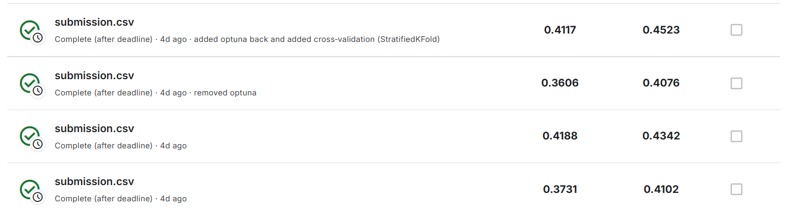
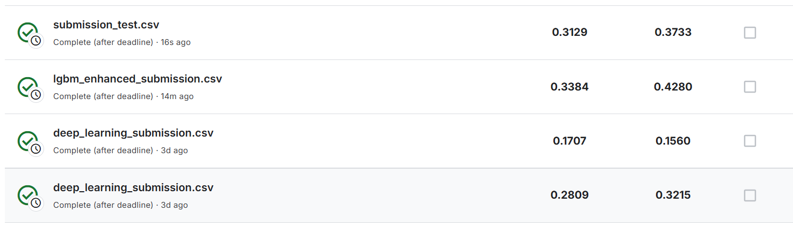

# MALLORN-Astronomical-Classification-Challenge
-----------
### Group Member/s:
- Cabrera, James Tan
- Cheung, Tsz Man
- LLovit, Benn Erico
- Regindin, Sean Adrien
-----------
### Result

- 1st Strategy - Use XGBoost to use as a classifier

| Attempt | Private Score| Public Score |
|----------|----------|----------|
| First Try    | 0.2845   | 0.253   |
| Added more features   | 0.3562   | 0.3542   |
| Weighted model   | 0.4141   | 0.4472   |

- 2nd Strategy - Use XGBoost, LightGBM, and Random Forest together
  
| Attempt | Private Score| Public Score |
|----------|----------|----------|
| First Try    | 0.3731   | 0.4102   |
| Added optuna   | 0.4188   | 0.4342   |
| Added cross-validation(Stratified Kfold)   | 0.4117   | 0.4523   |

- 3rd Strategy - Deep Learning

| Attempt | Private Score| Public Score |
|----------|----------|----------|
| First Try    | 0.2809   | 0.3215   |
| Added more features   | 0.1707   | 0.156   |
| Removed some features and added lgbm   | 0.3384   | 0.428   |

---
### Best Score in terms of Public Score
- 2nd Strategy | Added cross-validation(Stratified Kfold)   | 0.4117   | 0.4523   |
- 1st Strategy | Weighted model   | 0.4141   | 0.4472   |
- 2nd strategy | Added optuna   | 0.4188   | 0.4342   |
